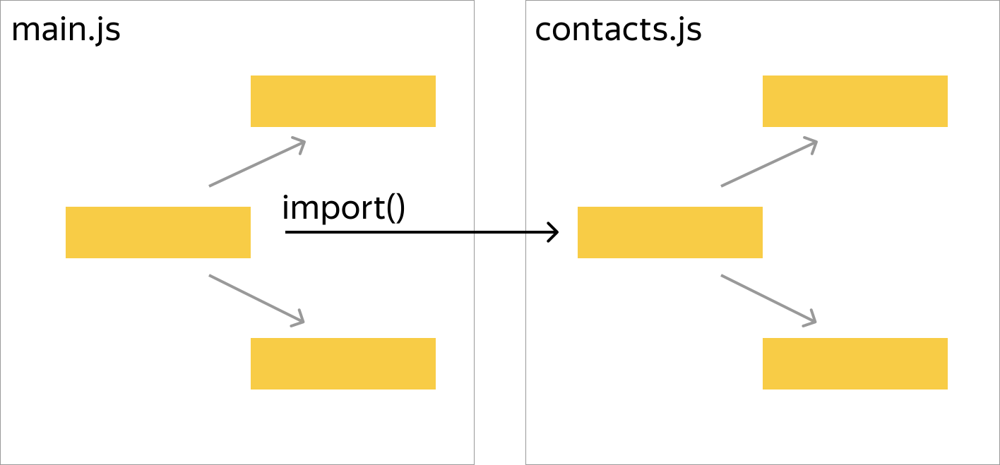
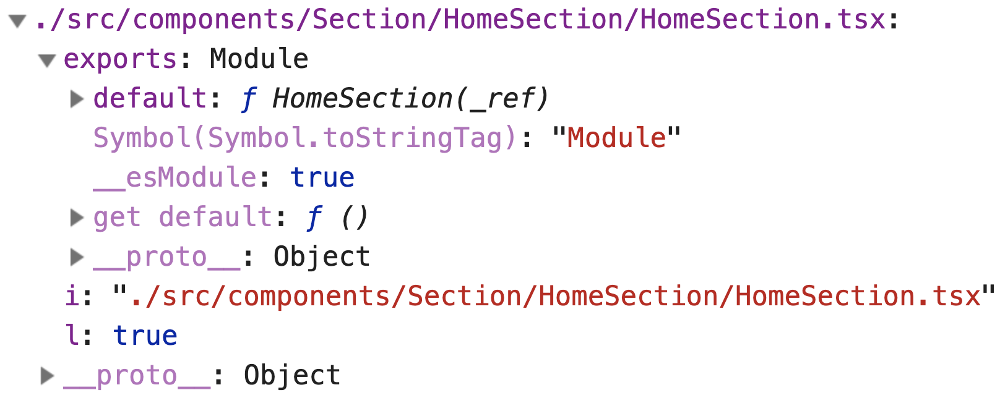
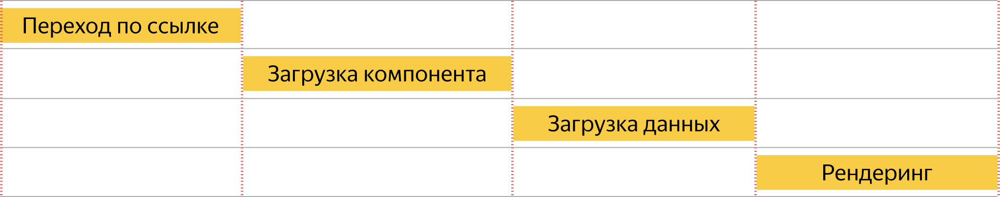
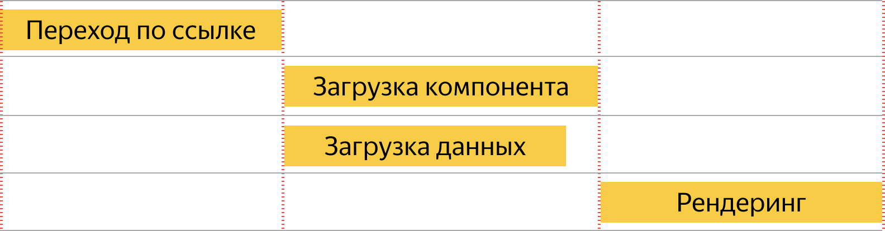

---

layout: yandex2

style: |
    .sbs-code .language-js {
        display: inline-block;
        width: 49%;
    }
    
    .ul-code .language-js {
        margin-left: 30px;
    }

    .qr > div {
        display: flex;
        vertical-align: middle;
        justify-content: center;
        align-items: center;
    }
    
    .qr img {
        height: 95vh;
    }
    
    .fit-image img {
        max-width: 100%;
    }
    
    .video video {
        width: 100%;
        height: 100%;
    }

    .video-dark {
        background: #262626;
    }
---

# {:.logo}

## {{ site.presentation.title }}
{:.title}

### {{ site.presentation.service }}



{:.nda}


<div class="authors">

<p>{{ site.author.name }}, {{ site.author.position }}</p>



<p>{{ site.author2.name }}, {{ site.author2.position }}</p>


</div>

## План

1. Архитектура
2. Подготовка данных
3. Маршрутизация
4. Code splitting
5. Паттерны

## Архитектура
{:.section}

## Архитектура

1. На первый запрос отвечаем готовой страницей (Server Side Rendering)
2. Переходы по ссылкам обрабатываем и рендерим на клиенте (Client Side Rendering) 
3. Сервер используем на второй фазе, как источник данных
4. Переиспользуем компоненты
5. Унифицируем подготовку данных

## Зачем нужен SSR?

1. SEO
2. Скорость
    - быстрая первая полезная отрисовка
    - меньше времени до интеракивности

## Разработка компонентов

1. Разрабатываем универсальные компоненты
2. Специфичные для окружения функции прячем за абстракции и условия:
    - обращения к модулям ноды (fs, path и т.п.)
    - обращение к API браузера (window.innerHeight и т.п.)
3. Рендеринг на сервере синхронный и за один проход
    - асинхронные операции дожидаемся до рендеринга
    - асинхронные компоненты делаем синхронными или откладываем их рендеринг до клиента

## Сборка

1. Клиентский код собираем webpack
2. Серверный код
    - webpack (мой выбор)
    - @babel/node
    - ts-node

## webpack.config.js
### [https://github.com/ftdebugger/react-school-2019/blob/master/webpack.config.js](https://github.com/ftdebugger/react-school-2019/blob/master/webpack.config.js)

```js
const serverConfig = require('./src/build/configs/server/webpack.config').default;
const clientConfig = require('./src/build/configs/client/webpack.config').default;

module.exports = [serverConfig, clientConfig];
```

## Настройка сборки стилей
{:.sbs-code}

```js
const client = {
  test: /\.scss$/,
  use: [
    MiniCssExtractPlugin.loader,
    'css-loader',
    'sass-loader',
  ],
}
```

```js
const server = {
  test: /\.scss$/,
  loader: 'null-loader',
}


```

## Артефакты сборки

```
dist
├── asset-manifest.json
├── client
│   └── assets
│       ├── _page.home.css
│       ├── _page.home.js
│       ├── _page.notFound.css
│       ├── _page.notFound.js
│       ├── _page.photo.css
│       ├── _page.photo.js
│       ├── main.css
│       └── main.js
└── main.js
```

## Сервер
### [https://github.com/ftdebugger/react-school-2019/blob/master/src/server/index.ts](https://github.com/ftdebugger/react-school-2019/blob/master/src/server/index.ts)

```js
import express from 'express';

import { join } from 'path';

const app = express();

app.use(express.static(join(__dirname, 'client')));

app.listen(3000);
```

## Входной компонент
### [https://github.com/ftdebugger/react-school-2019/blob/master/src/components/App/App.tsx](https://github.com/ftdebugger/react-school-2019/blob/master/src/components/App/App.tsx)
{:.ul-code}

- общая входная точка для клиента и сервера
- на клиенте с этого компонента будет начинаться гидратация

```jsx
export function App() {
    return (
        <h1>Hello world</h1>
    );
}
```

## Разделение на клиентский и серверный код
### [https://github.com/ftdebugger/react-school-2019/tree/master/src/components/App](https://github.com/ftdebugger/react-school-2019/tree/master/src/components/App)

```
src
└── components
    └── App
        ├── App.scss
        ├── App.tsx
        ├── App@client.tsx
        └── App@server.tsx
```

## Пример серверного кода
### [https://github.com/ftdebugger/react-school-2019/blob/master/src/components/App/App%40server.tsx](https://github.com/ftdebugger/react-school-2019/blob/master/src/components/App/App%40server.tsx)

```jsx
import { App as BaseApp } from 'components/App/App';

export function App() {
    return (
        <html lang="ru">
            <body>
                <div id="root">
                    <BaseApp />
                </div>
            </body>
        </html>
    );
}
```

## Маппинг клиенских ресурсов на сервере

 - В продакшен сборке имена клиентских ресурсов будут непредсказуемы
 - Нужно сформировать маппинг известных имен, на полученные при сборке
 - Нужен webpack плагин
 
## Webpack плагин для маппинга ресурсов
### [https://github.com/ftdebugger/react-school-2019/blob/master/src/build/configs/client/webpack.config.ts](https://github.com/ftdebugger/react-school-2019/blob/master/src/build/configs/client/webpack.config.ts#L92)

```js
new WebpackManifestPlugin({
    fileName: '../../asset-manifest.json',
    generate(seed, files) {
        // ․․․
    },
})
```

## Результат

```json
{
  "files": {
    "main.css": "/assets/0555b41d.css",
    "main.js": "/assets/cea9fc4b.js",
    "page.home.css": "/assets/_015355d4.css",
    "page.home.js": "/assets/_f9015022.js",
    "page.notFound.css": "/assets/_137bfafa.css",
    "page.notFound.js": "/assets/_ffb93b09.js",
    "page.photo.css": "/assets/_9a34d8d2.css",
    "page.photo.js": "/assets/_067a3cd1.js"
  }
}
```

## Использование
### [https://github.com/ftdebugger/react-school-2019/blob/master/src/server/middleware/clientAssets.ts](https://github.com/ftdebugger/react-school-2019/blob/master/src/server/middleware/clientAssets.ts)

```jsx
readFile(join(__dirname, 'asset-manifest.json'), () => { /* формируем files */ });
// ․․․
export function App({ files }) {
    return (
        <html lang="ru">
            <body>
                {/* ․․․ */}
                <script src={files['main.js']} defer />
            </body>
        </html>
    );
}
```

## Рендеринг на сервере
### [https://github.com/ftdebugger/react-school-2019/blob/master/src/server/middleware/renderPage.tsx](https://github.com/ftdebugger/react-school-2019/blob/master/src/server/middleware/renderPage.tsx)

```jsx
import { renderToStaticMarkup } from 'react-dom/server';
import { App } from 'components/App/App@server';

export function renderPage() {
    return (req, res) => {
        let content = renderToStaticMarkup(<App files={req.state.files} />);

        res.send('<!DOCTYPE html>' + content).end();
    };
}
// server/index.ts
app.use(renderPage());
```

## Гидратация на клиенте
### [https://github.com/ftdebugger/react-school-2019/blob/master/src/client/index.ts](https://github.com/ftdebugger/react-school-2019/blob/master/src/client/index.ts)

```jsx
// src/client.ts
import { createElement } from 'react';
import { hydrate } from 'react-dom';
import { App } from 'components/App/App@client';

document.addEventListener('DOMContentLoaded', () => {
    hydrate(
        <App />, 
        document.getElementById('root')
    );
});
```

## Правила рендеринга на сервере

1. Рендеринг должен быть синхронным
2. Методы жизненного цикла не работают на сервере (componentDidMount и т.п.)
3. Эффекты не работают на сервере

## Правила гидратации

1. HTML при гидратации должен соответствовать выходному DOM дереву из реакта
2. Компонентное дерево не обязано быть идентичным на сервере и клиенте
3. Клинтские компоненты нужно вставлять после componentDidMount

## Пример не удачной гидратации
{:.fullscreen .video}

<video autoplay muted loop>
    <source src="videos/spinner-web.webm" type="video/webm">
    <source src="videos/spinner-web.mp4" type="video/mp4">
</video>

## Подготовка данных
{:.section}

## Работа с данными

1. Собираем все данные асинхронно перед рендерингом
2. Формируем единый стейт, единый источник правды (Redux)
3. Рендерим компоненты по стейту
4. Сериализуем стейт и отправляем на клиент
5. Десериализуем стейт на клиенте и гидратируем компоненты по нему 

## Сбор данных
### [https://github.com/ftdebugger/react-school-2019/blob/master/src/server/middleware/prepareState.ts](https://github.com/ftdebugger/react-school-2019/blob/master/src/server/middleware/prepareState.ts)

```js
export function prepareState() {
    return async function(req, res, next) {
        try {
            req.state = await getData(req);
            next();
        } catch (err) {
            next(err);
        }
    };
}
// server/index.ts
app.use(prepareState());
```

## Создание Redux Store
### [https://github.com/ftdebugger/react-school-2019/blob/master/src/utils/createStore/createStore.ts](https://github.com/ftdebugger/react-school-2019/blob/master/src/utils/createStore/createStore.ts)

```js
import * as redux from 'redux';

import { rootReducer } from 'store';
import { devToolsEnhancer } from 'redux-devtools-extension';

export function createStore(state) {
    return redux.createStore(rootReducer, state, devToolsEnhancer());
}
```

## Рендеринг на сервере
### [https://github.com/ftdebugger/react-school-2019/blob/master/src/components/App/App%40server.tsx](https://github.com/ftdebugger/react-school-2019/blob/master/src/components/App/App%40server.tsx)

```jsx
import { Provider } from 'react-redux';

export function App({ state }) {
    return (
        <Provider store={createStore(state)}>
            <html lang="ru">
                {/* ․․․ */}
                <SerializedState />
            </html>
        </Provider>
    );
}
```

## Сериализация стейта
### [https://github.com/ftdebugger/react-school-2019/blob/master/src/components/App/App%40server.tsx](https://github.com/ftdebugger/react-school-2019/blob/master/src/components/App/App%40server.tsx)

```jsx
let serializedState = 'window.__PRELOADED_STATE__=' 
    + JSON.stringify(state).replace(/</g, '\\u003c');

<script 
    dangerouslySetInnerHTML={ { __html: serializedState } } 
/>
```

## App@server.tsx
### [https://github.com/ftdebugger/react-school-2019/blob/master/src/components/App/App%40server.tsx](https://github.com/ftdebugger/react-school-2019/blob/master/src/components/App/App%40server.tsx)

```jsx
<Provider store={store}>
    <html lang="ru">
        <body>
            <div id="root">
                <BaseApp />
            </div>

            <script dangerouslySetInnerHTML={ { __html: serializedState } } />
            <script src={files['main.js']} defer />
        </body>
    </html>
</Provider>
```

## Гидратация на клиенте
### [https://github.com/ftdebugger/react-school-2019/blob/master/src/client/index.ts](https://github.com/ftdebugger/react-school-2019/blob/master/src/client/index.ts)

```jsx
const state = window.__PRELOADED_STATE__;

document.addEventListener('DOMContentLoaded', () => {
    hydrate(
        <App state={state} />, 
        document.getElementById('root')
    );
});
```

## App@client.tsx
### [https://github.com/ftdebugger/react-school-2019/blob/master/src/components/App/App%40client.tsx](https://github.com/ftdebugger/react-school-2019/blob/master/src/components/App/App%40client.tsx)

```jsx
import { App as BaseApp } from 'components/App/App';

export function App({ state }) {
    return (
        <Provider store={createStore(state)}>
            <BaseApp />
        </Provider>
    );
};
```

## Про что нужно помнить

1. Сериализованные данные могут содержать XSS -- `{login: '</script>'}`
2. Передавайте только те данные, которые вам нужны (размер, утечки)
3. Используйте CSP и подписывайте свои данные через хеш или nonce


## Маршрутизация
{:.section}

## Какие бывают типы маршрутизации

1. Серверная (express, koa-router и т.п.)
2. Клиентские (vue-router)
3. Универсальные (react-router)

## react-router
### [https://reacttraining.com/react-router/web/guides/quick-start](https://reacttraining.com/react-router/web/guides/quick-start)

1. Декларативное описание маршрутов
2. Работает на сервере и на клиенте
3. Хорошо интегрируется с другими популярными библиотеками


## react-router
### [https://reacttraining.com/react-router/web/api/Switch](https://reacttraining.com/react-router/web/api/Switch)

```jsx
function App() {
    return (
        <Switch>
            <Route exact path="/" component={Home} />
            <Route path="/about" component={About} />
            <Route path="/topics" component={Topics} />
            <Route component={NotFound} />
        </Switch>
    );
}
```


## App@client.ts
### [https://reacttraining.com/react-router/web/api/BrowserRouter](https://reacttraining.com/react-router/web/api/BrowserRouter)

```jsx
import { BrowserRouter } from 'react-router-dom';

export function App({ state }) {
    return (
        <BrowserRouter>
            <Provider store={createStore(state)}>
                <BaseApp />
            </Provider>
        </BrowserRouter>
    );
};
```


## App@server.ts
### [https://reacttraining.com/react-router/web/guides/server-rendering](https://reacttraining.com/react-router/web/guides/server-rendering)

```jsx
import { StaticRouter } from 'react-router';

export function App({ url, state }) {
    return (
        <StaticRouter url={url}>
            <Provider store={createStore(state)}>
                <html lang="ru">{/* ․․․ */}</html>
            </Provider>
        </StaticRouter>
    );
}
```

## Клиентские переходы
### [https://reacttraining.com/react-router/web/api/Link](https://reacttraining.com/react-router/web/api/Link)

```jsx
import { Link } from 'react-router-dom';

export function Navigation() {
    return (
        <nav className="nav">
            <Link to="/" className="nav__link">Главная</Link>
            <Link to="/about" className="nav__link">Контакты</Link>
        </nav>
    );
}
```

## Загрузка данных

1. Маршрут определяется во время рендеринга
2. Рендеринг синхронный
3. Данные должны быть подготовлены перед рендерингом

## Решение

1. Соберем все маршруты в единое место
2. На этапе загрузки данных будем определять подходящий маршрут
3. На этапе рендеринга переиспользуем роуты

## Общий конфиг маршрутизации
### [https://github.com/ftdebugger/react-school-2019/blob/master/src/pages.ts](https://github.com/ftdebugger/react-school-2019/blob/master/src/pages.ts)

```js
export const PAGES = {
    home: {
        exact: true,
        path: '/',
        component: Home,
    },
    photo: {
        path: '/photo/:id',
        component: Photo,
    },
    notFound: { component: NotFound },
};
```

## Использование в компоненте
### [https://github.com/ftdebugger/react-school-2019/blob/master/src/components/App/App.tsx](https://github.com/ftdebugger/react-school-2019/blob/master/src/components/App/App.tsx)

```html
function App() {
    return (
        <Switch>
            {Object.keys(PAGES).map(routeName => (
                <Route key={routeName} {․․․PAGES[routeName]} />
            ))}
        </Switch>
    );
}
```

## Матчинг маршрута
### [https://reacttraining.com/react-router/web/api/matchPath](https://reacttraining.com/react-router/web/api/matchPath)

```js
import { matchPath } from 'react-router';

export function matchUrl(url) {
    for (let routeName of Object.keys(PAGES)) {
        let result = matchPath(url, PAGES[routeName]);

        if (result) {
            return { route: routeName, ․․․result };
        }
    }
}
```

## Матчинг маршрута (/photo/:id)
### [https://github.com/ftdebugger/react-school-2019/blob/master/src/server/utils/matchUrl.ts](https://github.com/ftdebugger/react-school-2019/blob/master/src/server/utils/matchUrl.ts)

```js
matchUrl('/photo/some-id');

{
    route: 'photo'
    params: {
        id: 'some-id'
    }
    path: '/photo/:id'
    url: '/photo/some-id'
}
```

## Загрузка данных на сервере

```js
export function prepareState() {
    return async function(req, res, next) {
        try {
            let location = matchUrl(req.url);

            req.state = await getData(req, location);
            next();
        } catch (err) {
            next(err);
        }
    };
}
```

## Итого

1. Матчим маршрут перед загрузкой данных
2. Загружаем данные с учетом маршрута
3. Рендерим страницу на сервере
4. Гидрируем страницу на клиенте

## Клиентские переходы

* За изменения URL и рендеринг компонентов будет отвечать react-router
* Мы отвечаем за загрузку данных и обработку ошибок
* Загружать данные можно покомпонентно или централизовано

## Загрузка данных из компонентов
### [https://reacttraining.com/react-router/web/api/withRouter](https://reacttraining.com/react-router/web/api/withRouter)

```jsx
import { withRouter } from 'react-router';

export const PhotoPage = withRouter(({ match }) => {
    let dispatch = useDispatch();
    let photo = useSelector((state) => state.photo);

    useEffect(() => {
        dispatch(fetchPhoto(match.params.id)); 
    }, [match.params.id]);

    return photo ? <Photo photo={photo} /> : 'Загружаем․․․';
});
```
<!--
## Загрузка данных в Redux

1. Редьюсеры в Redux синхронные
2. Загрузка данных асинхронная
3. Middleware в редаксе могут быть асинхронными

## redux-thunk
### [https://github.com/reduxjs/redux-thunk](https://github.com/reduxjs/redux-thunk)

```js
import * as redux from 'redux';

import { rootReducer } from 'store';
import { composeWithDevTools } from 'redux-devtools-extension';
import { applyMiddleware } from 'redux';
import thunk from 'redux-thunk';

export function createStore(state) {
    let enhancer = composeWithDevTools(applyMiddleware(thunk));

    return redux.createStore(rootReducer, state, enhancer);
}
```

## Action creator (redux-thunk)
### [https://github.com/reduxjs/redux-thunk](https://github.com/reduxjs/redux-thunk)

```js
export function fetchPhoto(photoId) {
    return async function(dispatch, getState) {
        let response = await fetch('/api/photo/' + photoId);
        let data = await response.json();

        dispatch(setPhoto(data));
    };
}
```

## Зачем это нужно?

1. Переиспользование и композиция кода (прогресс загрузки, ошибки, кеширование)
2. Отделение бизнес логики от отображения
3. Упрощение покрытия unit тестами

## Пример общей логики

```js
export function fetchPhoto(photoId) {
    return async function(dispatch, getState) {
        try {
            dispatch(setPhotoLoading(true));
            await fetch(․․․);    
            dispatch(setPhoto(data));
        } catch (err) {          
            dispatch(setPhotoError(err));            
        } finally {
            dispatch(setPhotoLoading(false));            
        }
    };
}
```
-->

## Code splitting
{:.section}

## Основы code-splitting



## Пример кода

```jsx
const Home = React.lazy(() => import('components/Home'));

export function App() {
    return (
        <React.Suspense fallback="Loading․․․">
            <Home />
        </React.Suspense>
    );
}
```

## Подводные камни

1. Не работает на сервере (рендеринг не синхронный)
2. Не работает гидратация (гидратация не синхронная)

## План

1. Делаем компонент синхронным на сервере
2. Перед гидрацией загружаем бандл с компонентом
3. Делаем синхронную гидрацию
4. Продолжаем работать асинхронно

## Собственный ленивый загрузчик

```js
let Home = lazyComponent({
    asyncLoader: () => import('components/Home'),
    syncLoader: () => require('components/Home')
});
```

## Магия webpack

```js
let Home = lazyComponent({
    asyncLoader: () => {
        if (typeof window !== 'undefined') {
            return import('components/Home');
        }
    },
    syncLoader: () => {
        if (typeof window === 'undefined') {
            return require('components/Home');
        }
    }
});
```

## Настройка webpack

```js
// Client
plugins: [
    new DefinePlugin({ 'typeof window': '"object"' }),
],

// Server
plugins: [
    new DefinePlugin({ 'typeof window': '"undefined"' }),
],
```

## Результат для сервера

```js
let Home = lazyComponent({
    asyncLoader: () => {
        if (false) {
        }
    },
    syncLoader: () => {
        if (true) {
            return require('components/Home');
        }
    }
});
```

## Результат для клиента

```js
let Home = lazyComponent({
    asyncLoader: () => {
        if (true) {
            return import('components/Home');
        }
    },
    syncLoader: () => {
        if (false) {
        }
    }
});
```

## lazyComponent

```js
export function lazyComponent({ asyncLoader, syncLoader }) {
    return (props) => {
        let syncModule = syncLoader(), Component;
    
        if (syncModule) {
            Component = syncModule.default;            
        } else {
            Component = React.lazy(asyncLoader);
        }

        return <Component {․․․props} />;
    };
}
```

## Пример бага
{:.fullscreen .video .video-dark}

<video autoplay muted loop>
    <source src="videos/lazy-reload.webm" type="video/webm">
    <source src="videos/lazy-reload.mp4" type="video/mp4">
</video>

## API webpack
### [https://webpack.js.org/api/module-methods/](https://webpack.js.org/api/module-methods/)

```js
// 1
require('components/App'); // module.exports
// 2
require.resolve('components/App'); // ./src/components/App.tsx
// 3
require.resolveWeak('components/App'); // ./src/components/App.tsx
// 4
require.cache // { [moduleId]: module }
```

## Структура require.cache



## API webpack

```js
let Home = lazyComponent({
    id: require.resolveWeak('components/Home'),
    asyncLoader: () => {
        if (typeof window !== 'undefined') {
            return import('components/Home');
        }
    },
    syncLoader: () => {
        if (typeof window === 'undefined') {
            return require('components/Home');
        }
    }
});
```
## lazyComponent (webpack API)
### [https://github.com/ftdebugger/react-school-2019/blob/master/src/components/Lazy/Lazy.tsx](https://github.com/ftdebugger/react-school-2019/blob/master/src/components/Lazy/Lazy.tsx)

```js
export const lazyComponent = ({ id, asyncLoader, syncLoader }) => (props) => {
    let syncModule = syncLoader(), Component;

    if (syncModule) {
        Component = syncModule.default;            
    } else if (require.cache[id]) {
        Component = require.cache[id].exports.default;
    } else {
        Component = React.lazy(asyncLoader);
    }
    return <Component {․․․props} />;
};
```

## Прогрузка статики до гидратации

```jsx
document.addEventListener('DOMContentLoaded', async () => {
    let routeName = state.route.name;
    let Component = PAGES[routeName].component;

    if (Component.loader) {
        await Component.asyncLoader();
    } 

    hydrate(
        <App state={state} />, 
        document.getElementById('root')
    );
});
```

## Упрощение компонента
### [src/build/babel/lazyComponentBabelPlugin.ts](https://github.com/ftdebugger/react-school-2019/blob/master/src/build/babel/lazyComponentBabelPlugin.ts)
{:.ul-code}

- с помощью babel плагина или webpack лоадера можно убрать копипаст
- пример можно найти в [репозитории](https://github.com/ftdebugger/react-school-2019/blob/master/src/build/babel/lazyComponentBabelPlugin.ts)
- или использовать готовые библиотеки (loadable-components)
```js
let Home = lazyComponent(() => import('components/Home'));
```

## Паттерны
{:.section}

## @bem-react/classname
### [https://ru.bem.info/technologies/bem-react/classname/](https://ru.bem.info/technologies/bem-react/classname/)

```jsx
import { cn } from '@bem-react/classname';

const cnCard = cn('Card');

cnCard() === 'Card';
cnCard({ extended: true }) === 'Card Card_extended';
cnCard({ theme: 'promo' }) === 'Card Card_theme_promo';
cnCard('Carousel') === 'Card-Carousel';
cnCard('Carousel', { theme: 'ad' }) === 'Card-Carousel Card-Carousel_theme_ad';
cnCard(null, [ 'Some', 'Other' ]) === 'Card Some Other';
```

## Структура компонента

```
Card
├── -Carousel
│   └── Card-Carousel.tsx
├── -Contacts
│   ├── Card-Contacts.css
│   └── Card-Contacts.tsx
├── _theme
│   ├── Card_theme_outdated.css
│   ├── Card_theme_outdated.tsx
│   ├── Card_theme_promo.css
│   └── Card_theme_promo.tsx
├── Card.css
└── Card.tsx
```

## Пример компонента
### [https://ru.bem.info/technologies/bem-react/classname/](https://ru.bem.info/technologies/bem-react/classname/)

```jsx
import { cn } from '@bem-react/classname';
import './Card.css';

const cnCard = cn('Card');

export function Card({ className }) {
    return (
        <div className={cnCard(null, [className])}>
            ․․․
        </div>
    )
}
```

## Элементы

```jsx
import { Avatar } from 'components/Avatar/Avatar';
import { CardCarousel } from './-Carousel/Card-Carousel';
․․․
export function Card({ className }) {
    return (
        <div className={cnCard(null, [className])}>
            <CardCarousel />
            <Avatar className={cnCard('Avatar')} />
        </div>
    )
}
```

## Разметка

```html
<div class="Card">
    <div class="Card-Carousel">․․․</div>
    
    <div class="Avatar Card-Avatar">․․․</div>
</div>
```

## Модификаторы

```js
import { withBemMod } from '@bem-react/core';

import './Card_theme_promo.css';

export const CardThemePromo = withBemMod('Card', { theme: 'promo' });
```

## Модификаторы

```jsx
import { withBemMod } from '@bem-react/core';
import './Card_theme_outdated.css';

function CardThemeOutdated(Base, props) {
    return (
        <Base {․․․props}>
            <Overlay />
        </Base>
    );
}
export const CardThemeOutdated = 
    withBemMod('Card', { theme: 'outdated' }, CardThemeOutdated);
```

## Применение модификаторов
### [https://ru.bem.info/technologies/bem-react/core/](https://ru.bem.info/technologies/bem-react/core/)

```jsx
import { compose } from '@bem-react/core';
import { Card } from 'components/Card/Card';
import { CardThemePromo } from 'components/Card/_theme/Card_theme_promo';
import { CardThemeOutdated } from 'components/Card/_theme/Card_theme_outdated';

const MyCard = componse(CardThemePromo, CardThemeOutdated)(Card);

<MyCard theme="promo" />
<MyCard theme="outdated" />
```

## Redux middleware
### [https://redux.js.org/advanced/middleware](https://redux.js.org/advanced/middleware)

```js
function middleware(store) {
    return function(next) {
        return function(action) {
            return next(action);
        };
    };
}

const middleware = store => next => action => {
    return next(action);
}
```

## Заголовок страницы

```js
const changeTitle = store => next => action => {
    let result = next(action);
    
    document.title = getPageTitle(store.getState());

    return result;
}
```

## redux-thunk

```js
const thunk = store => next => action => {
    if (typeof action === 'function') {
        return action(store.dispatch, store.getState);
    }

    return next(action);
}
```

## Подключение

```js
import { applyMiddleware } from 'redux';

export function createStore(state) {
    let enhancer = composeWithDevTools(applyMiddlware(thunk, changeTitle));

    return redux.createStore(rootReducer, state, enhancer);
}
```

<!-- 
## Последовательная загрузка
{:.fit-image}



## Параллельная загрузка
{:.fit-image}



## Параллельная загрузка (код)

```jsx
export const App = withRouter(({ match }) => {
    useEffect(() => {
        let route = matchUrl(location.toString());

        if (route.routeName === 'home') { ․․․ }
    }, [match]);

    return (
        <Switch>
            {Object.keys(PAGES).map(․․․)}
        </Switch>
    );
});
```
 -->
 
## Основные ссылки

1. [ftdebugger/react-school-2019](https://github.com/ftdebugger/react-school-2019) - репозиторий со всем кодом из презентации
2. [bem.info](https://ru.bem.info/technologies/bem-react/) - документация по БЭМ
3. [next.js](https://nextjs.org/) - один из примеров готового SSR из коробки
4. [loadable-components](https://github.com/smooth-code/loadable-components) - react code splitting


## Ссылка на код
{:.qr .fullscreen}


## Контакты 
{:.contacts}



<figure markdown="1">

### {{ site.author.name }}


{{ site.author.position }}


</figure>





<figure markdown="1">

### {{ site.author2.name }}


{{ site.author2.position }}


</figure>



<!-- разделитель контактов -->
-------

<!-- left -->
- {:.mail}ftdebugger@yandex-team.ru
- {:.github}ftdebugger

<!-- right -->
- {:.twitter}@ftdebugger
- {:.telegram}ftdebugger

<!-- 

- {:.mail}author@yandex-team.ru
- {:.phone}+7-999-888-7766
- {:.github}author
- {:.bitbucket}author
- {:.twitter}@author
- {:.skype}author
- {:.instagram}author
- {:.facebook}author
- {:.vk}@author
- {:.ok}@author

-->
